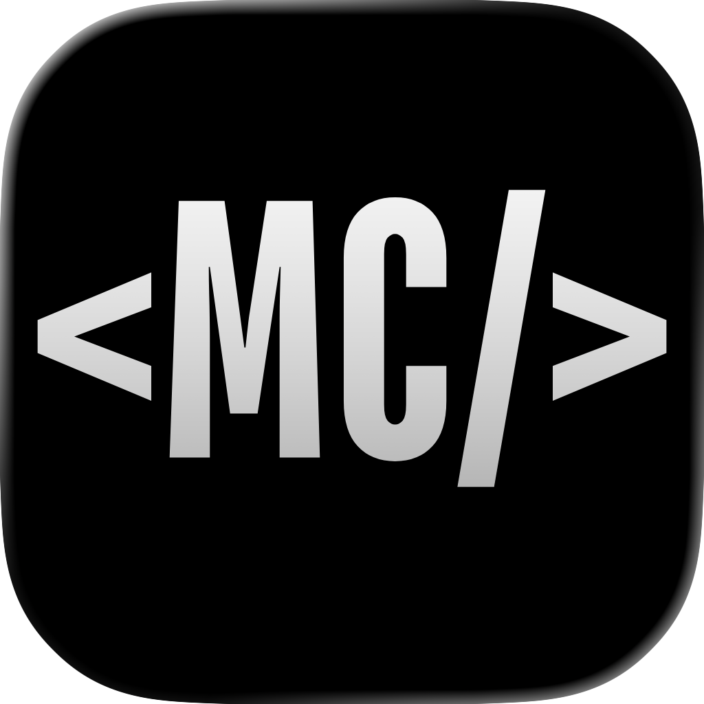
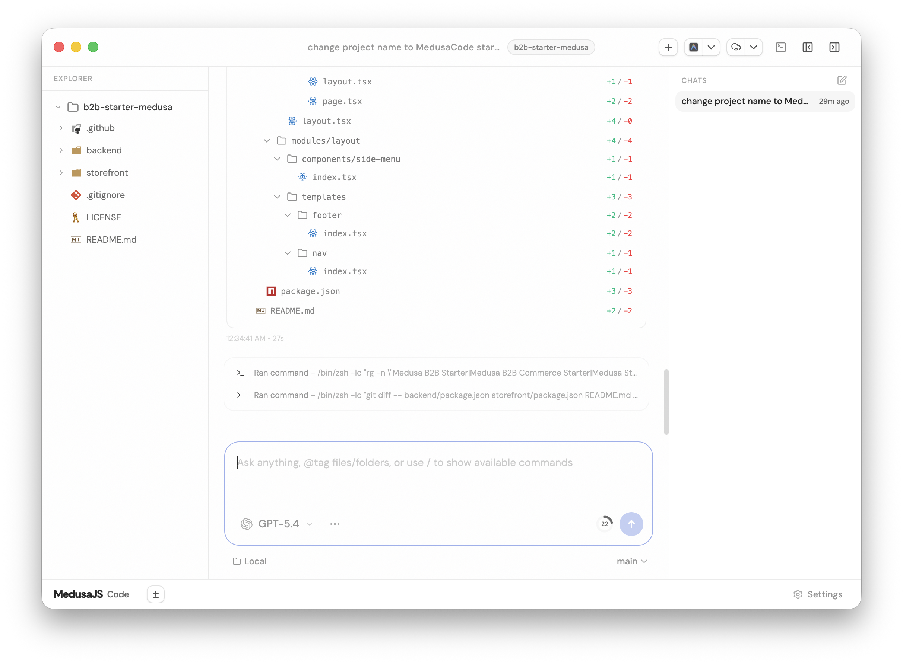

<div align="center">
  
  <h1>MedusaJS Code</h1>
  <p><strong>The premier desktop AI assistant for MedusaJS developers.</strong></p>
</div>

<p align="center">
  <a href="https://medusajscode.pages.dev/">🌐 Website & Download</a> •
  <a href="./CONTRIBUTING.md">🤝 Contribute</a>
</p>

---

## Overview

**MedusaJS Code** is an early WIP, lightning-fast desktop AI coding assistant specifically designed to help you build **high-quality MedusaJS frontends and backends** faster than ever. It acts as a minimal web GUI for powerful coding agents (currently Codex and Claude, with more coming soon), giving you predictable, reliable AI assistance tailored for real, complex Medusa codebases.



## Why MedusaJS Code?

- **Medusa-Optimized:** Built from the ground up to handle the complexity of MedusaJS e-commerce architectures, custom API routes, and storefronts.
- **Agent Integrations:** Direct UI support for OpenAI's Codex and Anthropic's Claude.
- **Lightning Fast:** Native desktop performance on macOS, Windows, and Linux.
- **Predictable:** Correctness-first approach ensuring reliable session recovery and safe project access.

## How to use

> [!WARNING]
> You need to have [Codex CLI](https://github.com/openai/codex) installed and authorized for MedusaJS Code to work.

If you don't use the compiled desktop version, you can run it via the CLI:
```bash
npx medusajscode
```

However, we recommend running the highly-optimized **Desktop App**.

📥 **[Download MedusaJS Code Desktop](https://medusajscode.pages.dev/)**

*(Or grab the raw binaries from our [GitHub Releases page](https://github.com/luckycrm/medusajscode/releases))*

## Current Status

We are **very very early** in this project. Expect bugs.

We are not actively accepting large contributions immediately, but bug reports and feature ideas are extremely welcome!

## If you REALLY want to contribute still.... read this first

Read [CONTRIBUTING.md](./CONTRIBUTING.md) before opening an issue or PR.

## Acknowledgements

This project is a fork of [T3 Code](https://github.com/pingdotgg/t3code) by [ping.gg](https://ping.gg). We would like to extend our immense gratitude to the original authors for their incredible work and the technical foundation of this project.
